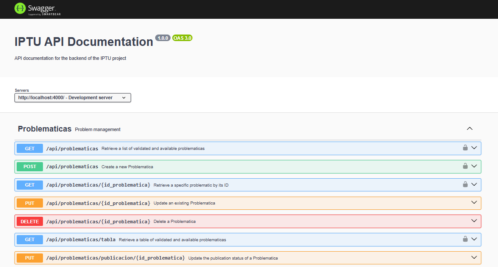
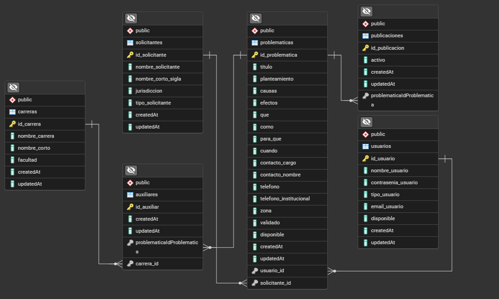
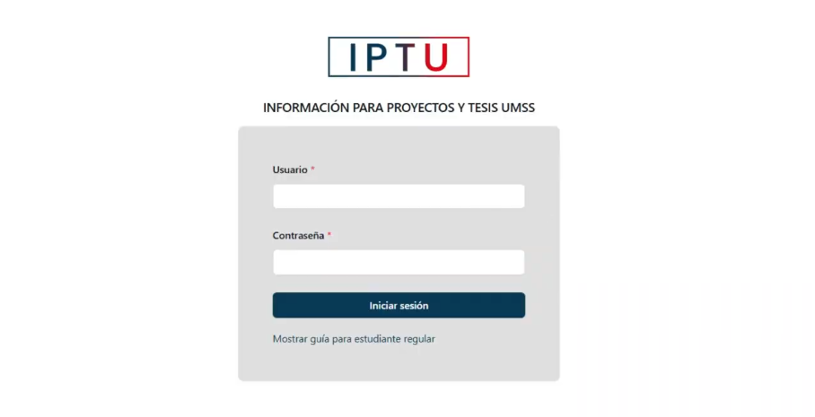

# 📚 Backend - IPTU (Información para Proyectos y Tesis UMSS)

Este repositorio contiene el **backend de IPTU**, un sistema web desarrollado para la **visualización y gestión de temas de proyectos de grado o tesis** en la Universidad Mayor de San Simón (UMSS). Está diseñado para facilitar la interacción entre estudiantes, entidades públicas o privadas, y la universidad, promoviendo la colaboración y aprovechamiento de propuestas reales para trabajos de titulación.

## 📦 Contenido del API

Este backend expone las siguientes rutas mediante Express:

- `/api/usuarios` → Gestión de usuarios y autenticación
- `/api/solicitantes` → Registro y gestión de entidades externas
- `/api/carreras` → Consulta y gestión de carreras universitarias
- `/api/problematicas` → Gestión de temas propuestos (problemáticas)

El servidor corre en el puerto:

```
http://localhost:4000/
```

## 🧰 Tecnologías utilizadas

- **Node.js**
- **Express**
- **Sequelize** (ORM para PostgreSQL)
- **PostgreSQL**
- **dotenv**
- **JWT** (JsonWebToken) → Para autenticación segura
- **moment-timezone**
- **CORS**
- **Morgan**
- **UUID**
- **XLSX** (para exportación/importación de datos)
- **Swagger** Documentación interactiva de la API

## ▶️ Instalación y ejecución

1. Clona el repositorio y entra a la carpeta del backend.
2. Instala las dependencias:

```bash
npm install
```

4. Crea una base de datos en PostgreSQL
5. Crea un archivo `.env` con las variables necesarias como `URL_DATABASE`.
6. Sincroniza la base de datos con Sequelize
> Esto se encargará de sincronizar todos los modelos con la base de datos usando Sequelize
```bash
npm run syncdb
```
8. Inicia el servidor:

```bash
npm run dev
```

> El servidor escuchará en el puerto definido (por defecto `4000`).

## 📖 Documentación Swagger

Puedes acceder a la documentación interactiva de la API desde:

```
http://localhost:4000/api-docs
```

Aqui se visualiza la documentacion de la API utilizando Swagger



## 🗄️ Diagrama de la base de datos

Aquí se visualiza el esquema general utilizado en MongoDB para la gestión de datos:



## 📸 Vista inicial frontend

Aquí se visualiza el login para el ingreso al sistema `IPTU`, al cual le proveemos los servicios necesarios desde el backend para el correcto funcionamiento de sus funcionalidades principales.


